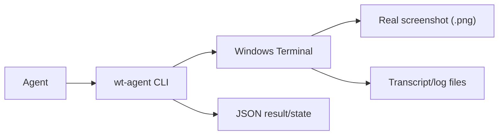

# WtAgent

`WtAgent` is a Windows Terminal wrapper for AI agents.

It runs commands in a real Windows Terminal window, captures real screenshots of the rendered output, keeps recoverable interactive sessions, and can continue inside WSL while preserving visual evidence and machine-readable state.

## Why

Most terminal tooling gives an agent only plain text. `WtAgent` adds a second channel:

- real screenshots of what Windows Terminal actually rendered
- structured JSON for runs and interactive sessions
- recoverable session state after context loss
- interrupt support for long-running commands
- nested WSL tracking inside the same terminal session

## What It Does

- `run`: execute one command and return JSON plus a real screenshot
- `session-start`: open a long-lived Windows Terminal session
- `session-send`: type input into the live terminal
- `session-submit`: submit staged input later so the typed command is visible on-screen
- `session-capture`: take a fresh screenshot of the current terminal view
- `session-interrupt`: send `Ctrl+C`
- `session-list` and `session-inspect`: recover lost sessions
- `session-enter-wsl`: switch the live session into tracked WSL bash mode

## Flow



## Install

The primary end-user install path is the normal Windows setup wizard from GitHub Releases:

1. Open [Releases](https://github.com/11ArkaN/WtAgent/releases/latest)
2. Download `WtAgent-Setup.exe`
3. Run the setup wizard

The setup installer:

- installs `WtAgent` as a normal per-user Windows app
- creates an entry in `Installed apps`
- can add `wt-agent` to the user `PATH`
- can install the `wt-agent-terminal` skill for Codex, Claude Code, and Cursor during setup

For developers who want a local unpublished install from the repo:

```powershell
powershell -ExecutionPolicy Bypass -File .\scripts\install-wt-agent.ps1 -InstallSkill
```

## Agent Skill

This repo is laid out in a `skills.sh`-compatible structure:

- `skills/wt-agent-terminal`

That means the skill can be installed to multiple agent ecosystems, not only Codex.

Install from a local checkout with `skills.sh`:

```bash
cd /path/to/WtAgent
npx skills add . --skill wt-agent-terminal
```

Or install by pointing directly at the public repo:

```bash
npx skills add https://github.com/11ArkaN/WtAgent --skill wt-agent-terminal
```

Short GitHub form:

```bash
npx skills add 11ArkaN/WtAgent --skill wt-agent-terminal
```

Target a specific agent explicitly:

```bash
npx skills add 11ArkaN/WtAgent --skill wt-agent-terminal --agent codex
npx skills add 11ArkaN/WtAgent --skill wt-agent-terminal --agent claude-code
npx skills add 11ArkaN/WtAgent --skill wt-agent-terminal --agent cursor
```

Use `scripts/install-wt-agent-skill.ps1` only as the convenience path for Codex-style local installs on Windows. For cross-agent installation, prefer `npx skills add ...`.

Important: `npx skills add . --skill wt-agent-terminal` only works when `.` is the root of this repo. If you run it from `C:\Users\<you>`, then `skills` scans your home directory instead of `WtAgent`.

## Quick Start

Run one command:

```powershell
wt-agent run --command "curl.exe -v https://httpbin.org/get" --profile "Windows PowerShell" --cwd "C:\work"
```

Start an interactive session:

```powershell
wt-agent session-start --profile "Windows PowerShell" --cwd "C:\work"
wt-agent session-send --session-id <id> --input "curl.exe -v https://httpbin.org/get"
wt-agent session-stop --session-id <id>
```

Enter WSL in the same session:

```powershell
wt-agent session-enter-wsl --session-id <id>
wt-agent session-send --session-id <id> --input "pwd"
```

Recover a lost session:

```powershell
wt-agent session-list
wt-agent session-inspect --session-id <id>
```

## Output Model

Every command returns JSON. Important fields:

- `status`: success or failure state
- `artifacts`: file paths for screenshots and logs
- `window`: terminal PID and HWND when available
- `live`: current state for interactive sessions
- `shellKind` and `stateSource`: whether the active shell is PowerShell or nested WSL

## Artifact Layout

By default, `WtAgent` writes `.wt-agent` into the directory where the agent is currently working when it invokes the CLI.

That keeps artifacts separate per project, for example:

```text
project-a/.wt-agent/...
project-b/.wt-agent/...
```

If you want a custom location, pass `--artifacts-dir`.

## Releases

- Repo: [11ArkaN/WtAgent](https://github.com/11ArkaN/WtAgent)
- Latest release assets are published from GitHub Actions on tags `v*`
- Primary installer asset: `WtAgent-Setup.exe`
- Current installer target asset name: `wt-agent-win-x64.zip`
- Current skill asset name: `wt-agent-terminal-skill.zip`

## Development

Build:

```powershell
dotnet build wt-agent.sln
```

Test:

```powershell
dotnet test wt-agent.sln
```

Build a local setup exe:

```powershell
dotnet publish src/WtAgent/WtAgent.csproj -c Release -r win-x64 --self-contained true /p:PublishSingleFile=true /p:IncludeNativeLibrariesForSelfExtract=true /p:DebugType=None /p:DebugSymbols=false -o out/win-x64
```
